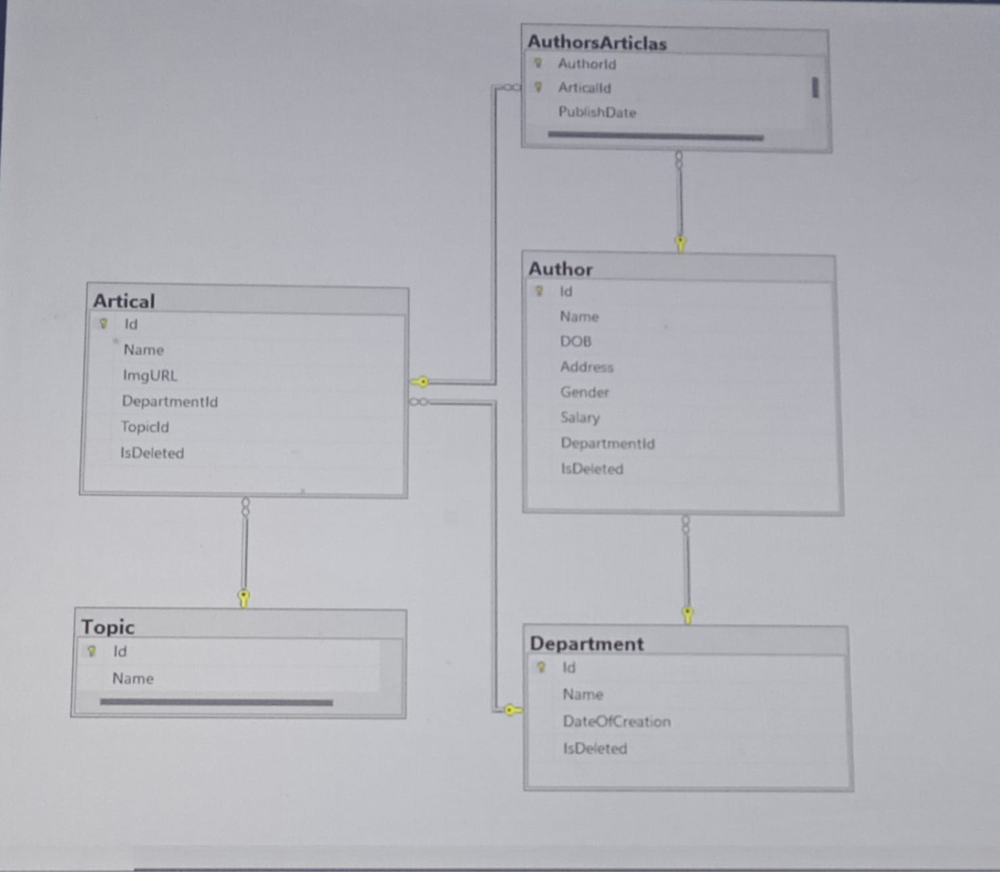

# 📚 Final Project – Articles Management System

## 📖 Overview
This project is an **Articles Management System** built with **ASP.NET Core MVC** and **Entity Framework Core**.  
It manages authors, departments, articles, and topics, with full CRUD operations and validation.  

---

## 🛠️ Tech Stack
### Back-End Technology
- **C#**
- **ASP.NET Core MVC**
- **Entity Framework Core**
- **SQL Server**

### Front-End Technology
- **Bootstrap** (for UI styling)
- **HTML**
- **CSS**

---

## ✨ Features
- Manage **Authors** (Create, Read, Update, Delete).
  - Auto-calculated age from Date of Birth.
  - Validation: Address must be either **Cairo** or **Giza**.
- Manage **Departments** with Date of Creation.
- Manage **Articles** and link them to Departments and Topics.
- Manage **Topics** (each article belongs to one topic).
- Define **Many-to-Many** relation between Authors and Articles through `AuthorsArticles` table.

---

## 🗄️ Database Schema
**Main Entities:**
- **Author**
- **Department**
- **Article**
- **Topic**
- **AuthorsArticles** (junction table for Many-to-Many)

---
